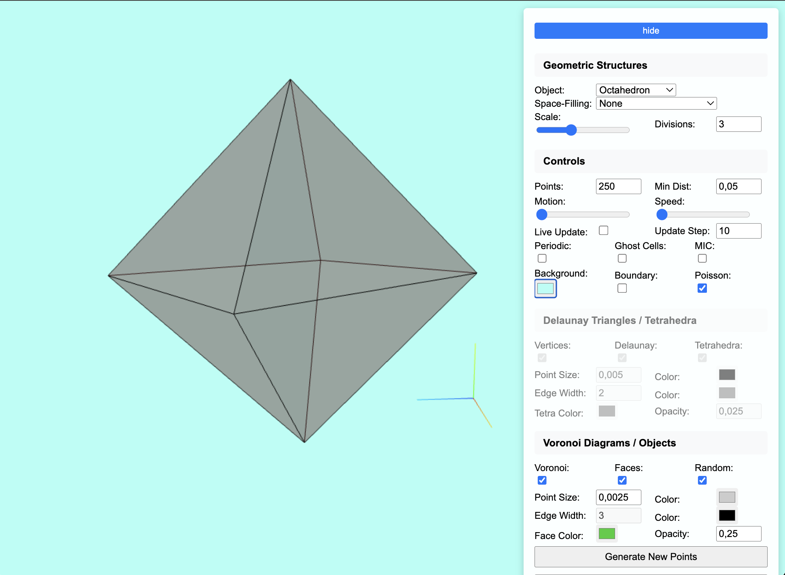
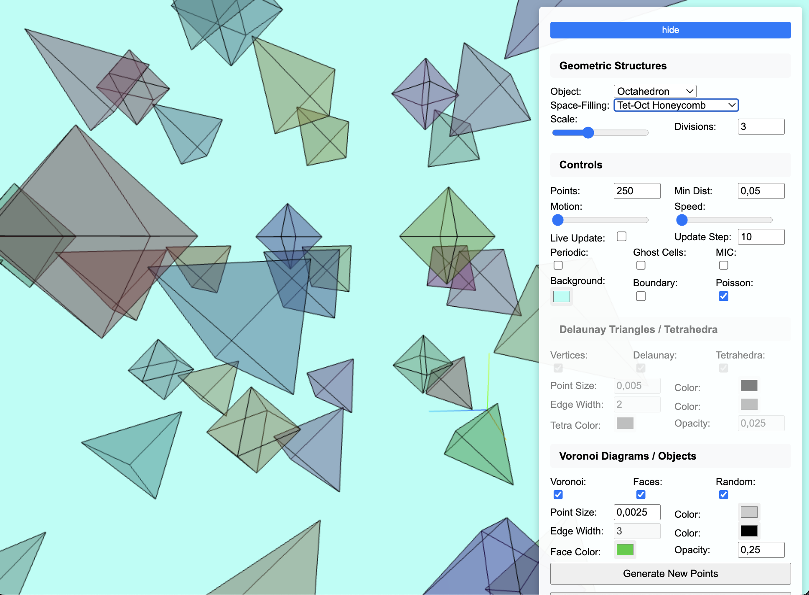

# Platonic-Solids-Voronoi-Delaunay

**[Live Demo](https://virtualorganics.github.io/Platonic-Solids-Voronoi-Delaunay/)**

A WebAssembly-powered 3D periodic Delaunay-Voronoi triangulation library for the browser, combining the computational power of [Geogram](https://github.com/BrunoLevy/geogram) with the visualization capabilities of [Three.js](https://github.com/mrdoob/three.js), now enhanced with interactive Platonic solids and space-filling structures.

<p align="center">
  
   
</p>

<p align="center">
  
   
</p>

<p align="center">
  
  
</p>

## ✨ New Features: Platonic Solids & Space-Filling Structures

This enhanced version adds comprehensive support for mathematical polyhedra alongside the original Geogram-Three.js functionality:

### 🔺 Platonic Solids
- **Tetrahedron**: 4 triangular faces, 4 vertices
- **Cube**: 6 square faces, 8 vertices
- **Octahedron**: 8 triangular faces, 6 vertices
- **Dodecahedron**: 12 pentagonal faces, 20 vertices
- **Icosahedron**: 20 triangular faces, 12 vertices

### 🏗️ Space-Filling Structures
- **Cubic Honeycomb**: Regular cubic grid tessellation
- **Tetrahedral-Octahedral Honeycomb**: Alternating tetrahedra and octahedra
- **Truncated Octahedron**: Body-centered cubic packing
- **Rhombic Dodecahedron**: Face-centered cubic dual

### 🎛️ Unified Control System
- **Seamless Integration**: Geometric objects use the same styling controls as Voronoi diagrams
- **Real-time Updates**: All parameters update visualization instantly
- **Smart Control Management**: Delaunay-specific controls automatically disable for geometric objects
- **Clean Wireframes**: Custom edge geometry shows actual polyhedron edges without triangulation artifacts

## Features

* **3D Delaunay Triangulation**: Compute Delaunay tetrahedralization of 3D point sets
* **3D Voronoi Diagrams**: Generate Voronoi cells from Delaunay triangulation using barycenter method
* **Periodic Boundary Conditions**: Support for periodic (toroidal) domains
* **WebAssembly Performance**: Native-speed computation in the browser
* **Three.js Visualization**: Interactive 3D rendering with orbit controls
* **Clean JavaScript API**: Simple, promise-based interface hiding WASM complexity
* **Interactive Platonic Solids**: Mathematical polyhedra with exact coordinates
* **Space-Filling Tessellations**: Honeycomb structures that tile 3D space

## Demo

**[Live Demo](https://virtualorganics.github.io/Platonic-Solids-Voronoi-Delaunay/)**

## Quick Start

### Using the Library

```javascript
import { DelaunayComputation } from './src/js/DelaunayComputation.js';

// Initialize the WASM module
const Module = await window.PeriodicDelaunayModule();

// Create points (array of [x, y, z] coordinates in range [0, 1])
const points = [
    [0.1, 0.2, 0.3],
    [0.4, 0.5, 0.6],
    // ... more points
];

// Create computation instance
const computation = new DelaunayComputation(points, true); // true for periodic

// Run the computation
await computation.compute(Module);

// Access results
console.log(`Computed ${computation.tetrahedra.length} tetrahedra`);
console.log(`Generated ${computation.voronoiEdges.length} Voronoi edges`);

// Tetrahedra: array of [v0, v1, v2, v3] vertex indices
// Voronoi edges: array of {start: [x,y,z], end: [x,y,z], isPeriodic: boolean}
```

### Visualization Example

```javascript
// Draw Delaunay edges
for (const tet of computation.tetrahedra) {
    // Extract and draw edges from tetrahedron
}

// Draw Voronoi diagram
for (const edge of computation.voronoiEdges) {
    const geometry = new THREE.BufferGeometry();
    const positions = new Float32Array([
        edge.start[0], edge.start[1], edge.start[2],
        edge.end[0], edge.end[1], edge.end[2]
    ]);
    geometry.setAttribute('position', new THREE.BufferAttribute(positions, 3));
    
    const material = edge.isPeriodic ? 
        new THREE.LineBasicMaterial({ color: 0xffaa00 }) : 
        new THREE.LineBasicMaterial({ color: 0xff6600 });
    
    const line = new THREE.Line(geometry, material);
    scene.add(line);
}
```

## API Reference

### DelaunayComputation Class

#### Constructor

```javascript
new DelaunayComputation(points, isPeriodic = true)
```

* `points`: Array of 3D points as `[[x,y,z], ...]` or flat array `[x,y,z,x,y,z,...]`
* `isPeriodic`: Boolean, whether to use periodic boundary conditions

#### Methods

**async compute(wasmModule)**

Runs the Delaunay-Voronoi computation. Returns the instance for chaining.

**getStats()**

Returns an object with computation statistics:

```javascript
{
    numPoints: number,
    numTetrahedra: number,
    numVoronoiEdges: number,
    isPeriodic: boolean
}
```

**getPeriodicDistance(p1, p2)**

Calculates the minimum image distance between two points in periodic space.

#### Properties

* `pointsArray`: Array of input points as `[[x,y,z], ...]`
* `tetrahedra`: Array of tetrahedra as `[[v0,v1,v2,v3], ...]`
* `voronoiEdges`: Array of Voronoi edges as `[{start, end, tetraIndices, isPeriodic}, ...]`
* `barycenters`: Array of tetrahedra barycenters as `[[x,y,z], ...]`

## Building from Source

### Prerequisites

* Emscripten SDK
* Node.js
* C++17 compiler

### Build Steps

```bash
# Clone the repository
git clone https://github.com/VirtualOrganics/Platonic-Solids-Voronoi-Delaunay.git
cd Platonic-Solids-Voronoi-Delaunay

# Build the WASM module
cd src/cpp
./build.sh

# The compiled files will be in dist/
```

## Implementation Details

### Voronoi Computation

The library computes Voronoi diagrams using the barycenter method:

1. Calculate the barycenter (center) of each Delaunay tetrahedron
2. Build adjacency information for tetrahedra sharing faces
3. Connect barycenters of adjacent tetrahedra to form Voronoi edges

### Periodic Boundaries

When periodic mode is enabled:

* Points are assumed to be in the unit cube [0, 1]³
* The space wraps around at the boundaries (toroidal topology)
* Edges crossing boundaries are marked with `isPeriodic: true`

### Platonic Solids Implementation

The geometric objects are generated using exact mathematical coordinates:

* **Mathematical Precision**: All vertices calculated using exact formulas
* **Golden Ratio**: Dodecahedron and Icosahedron use φ = (1 + √5)/2
* **Normalized Coordinates**: All shapes fit within [0,1]³ cube
* **Custom Edge Geometry**: Clean wireframes without triangulation artifacts

## Controls Guide

### Main Controls

* **Object Selection**: Choose from dropdown (Voronoi, Tetrahedron, Cube, Octahedron, Dodecahedron, Icosahedron, or Space-Filling structures)
* **Points**: The number of random points to generate.
* **Min Dist**: The minimum distance between generated points.
* **Motion**: The randomness of the point movement. Higher values result in more erratic paths.
* **Speed**: The speed at which the points travel.
* **Live Update**: When checked, the triangulation and Voronoi diagrams continuously update to reflect point motion.
* **Update Step**: Sets the number of frames to wait before each live update. Higher values are less intensive.
* **Periodic**: Toggles periodic boundary conditions, making the space wrap around like a torus.
* **Ghost Cells**: Displays the 26 neighboring "ghost" cells in periodic mode to visualize the toroidal space.
* **Background**: The background color of the scene.
* **Poisson**: Toggles Poisson disk sampling for point generation, which creates more evenly spaced points.
* **MIC**: Toggles the "Minimum Image Convention" visualization mode, which enables thick, adjustable edges.
* **Boundary**: Toggles the visibility of the boundary box.

### Delaunay Triangles / Tetrahedra

* **Vertices**: Toggles the visibility of the Delaunay vertices (the input points).
* **Delaunay**: Toggles the visibility of the Delaunay edges.
* **Tetrahedra**: Toggles the visibility of the Delaunay tetrahedra (the 3D cells).

### Voronoi Diagrams / Objects

* **Voronoi**: Toggles the visibility of the Voronoi edges (or geometric object edges).
* **Faces**: Toggles the visibility of the Voronoi cell faces (or geometric object faces).
* **Random Colors**: Toggles random coloring for the Voronoi faces.
* **Face Color**: Set the color of geometric object faces.
* **Edge Color**: Set the color of geometric object edges.
* **Opacity**: Control transparency of geometric objects.
* **Wireframe**: Toggle wireframe rendering for geometric objects.

### Geometric Objects

* **Scale**: Adjust the size of individual Platonic solids.
* **Divisions**: Control tessellation density for space-filling structures.
* **Rotation**: Enable automatic rotation of geometric objects.

## License

This project is licensed under the MIT License. See the LICENSE file for details.

## Acknowledgments

* [Geogram](https://github.com/BrunoLevy/geogram) by Bruno Levy for the computational geometry algorithms
* [Three.js](https://github.com/mrdoob/three.js) for 3D visualization
* [Emscripten](https://emscripten.org/) for WebAssembly compilation
* [VirtualOrganics/Geogram-Three.js](https://github.com/VirtualOrganics/Geogram-Three.js) for the original foundation 
